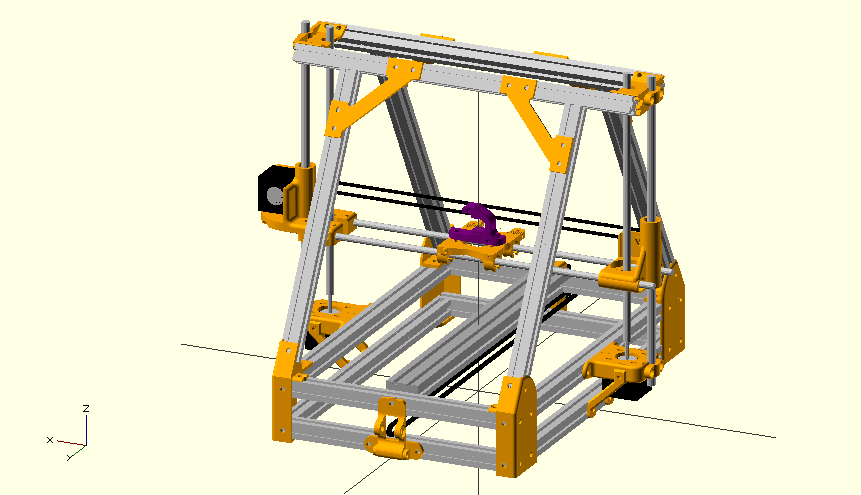

All the parts on my MendelMax in one place and model.

90% of the parts are from the upstream MendelMax design, 5% are from others, 5% from me.

use openscad and mm15_model.scad as a full model when building new brackets and such

model not done yet
